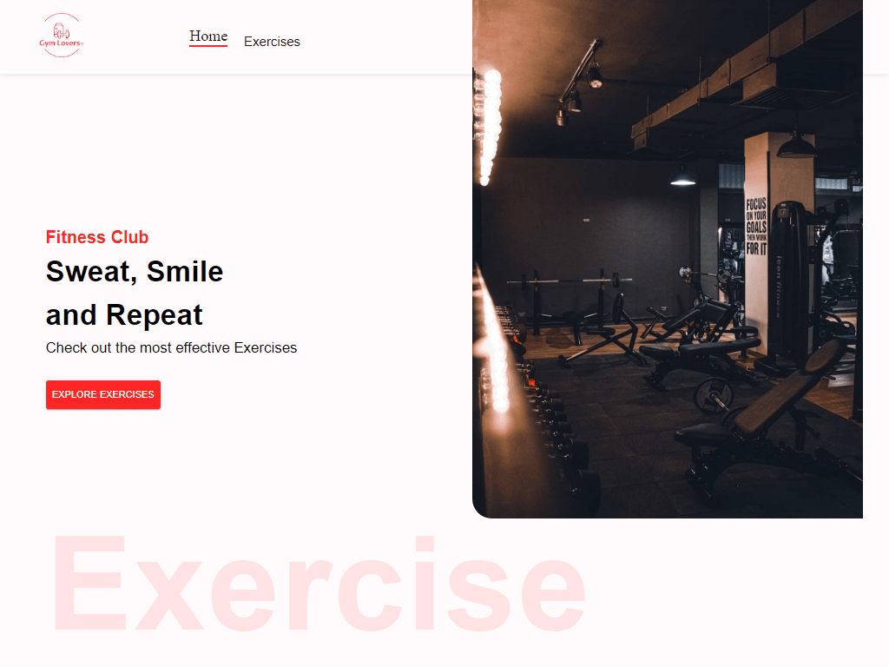
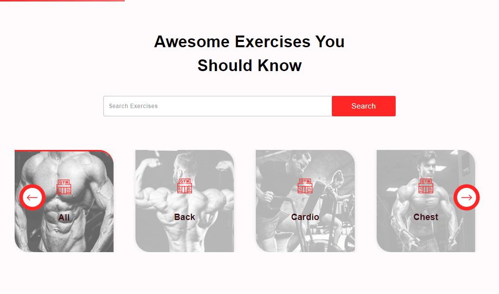
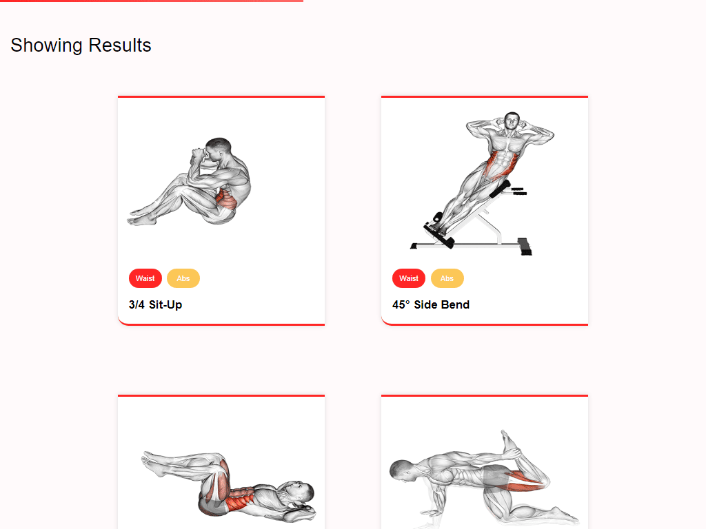
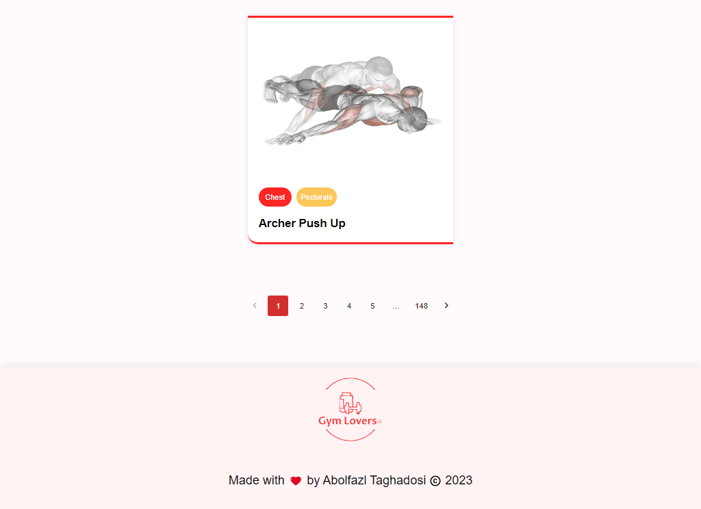
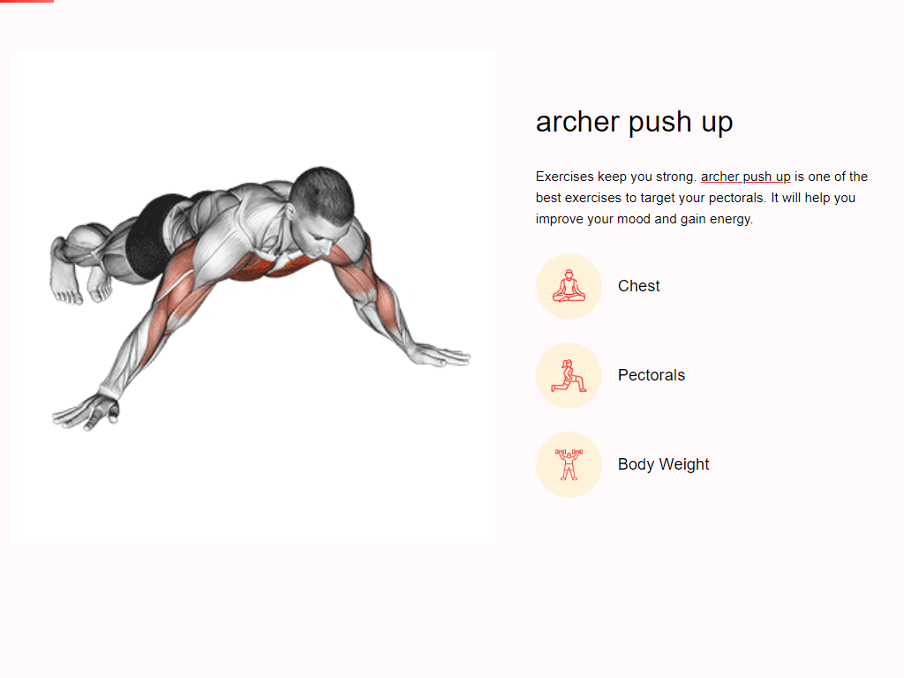
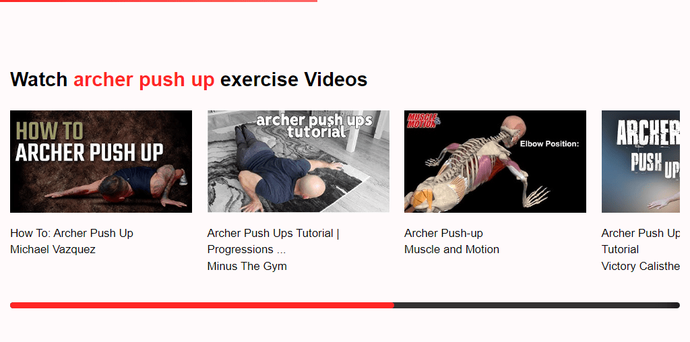
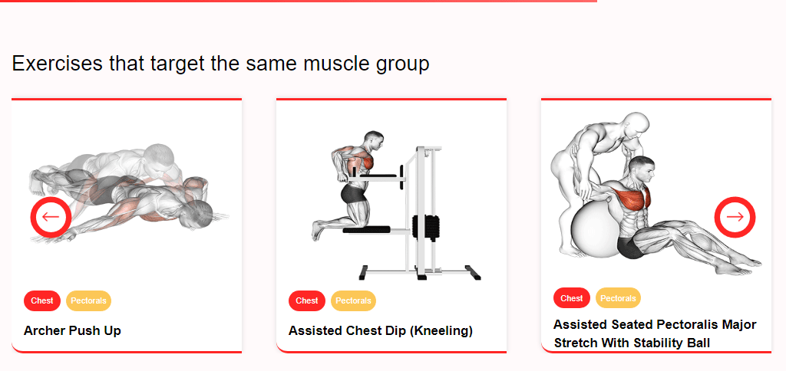

# 💪🏻 Gym Lovers

### a modern Web application fitness exercises app, with the functionality to choose exercise categories and specific muscle groups, browse more than 1000 exercises with practical examples and much more... . (اگه ایران هستید از فیلترشکن استفاده کنید)

## Link 🔗 [https://charactermi.github.io/gym-lovers](https://charactermi.github.io/gym-lovers)

 

# Preview

 

# Mobile Responsive

# Technologies

 

<ul>
    <li>
        
    </li>
    <li>
        
    </li>
    <li>
        
    </li>
    <li>
        
    </li>
    <li>
        
    </li>
</ul>
